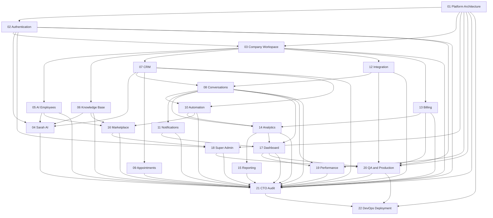

# ZiricAI Master Development Roadmap

**Last updated:** 2026-07-19  
**Workspace:** `C:\Users\cash\OneDrive\DOCUMENTS\PROJECTS\ziricai`  
**Agent specs:** [`docs/agents/`](./agents/README.md) (20 specialists + CTO + DevOps)

---

## Executive Summary

ZiricAI is a multi-tenant AI Business Operating System with a working Express API (`server.js`), Firebase Auth, WhatsApp webhook pipeline, Company Portal (`company-portal.html`), Super Admin Console (`ziric-superadmin-console.html`), Sarah AI orchestrator, Integration Hub, event-driven analytics/automation, and an Industry Pack marketplace.

**Overall platform maturity: ~58% (weighted average across 20 specialist agents).**

The codebase is strongest in **foundation scaffolding**, **Sarah AI**, **portal shell**, and **marketplace catalog**. The largest gaps are **strict auth/tenant enforcement**, **legacy→tenant data migration**, **appointments UI**, **reporting/export**, **real payment connectors**, and **automated QA**.

Use the 22 Cursor subagents as **single-responsibility execution units**. Run them in dependency order; the **CTO Agent (21)** performs the final cross-cutting audit after Phase 19, then **DevOps Agent (22)** owns production deployment in Phase 11.

**CTO audit (2026-07-19):** Overall readiness **52/100** — **NO-GO** for public production. See [`architecture/CTO_AUDIT_REPORT.md`](./architecture/CTO_AUDIT_REPORT.md).

**Launch Readiness Program (2026-07-19):** Cross-functional go-to-market checklist (~22% complete) — legal, sales, CS, growth gates separate from coding agents. See [`deployment/LAUNCH_READINESS_PROGRAM.md`](./deployment/LAUNCH_READINESS_PROGRAM.md).

---

## Phase Overview

| Phase | Theme | Agents | Avg. Status |
|-------|-------|--------|-------------|
| **1 — Foundation** | Architecture, auth, company workspace | 01–03 | **67% Partial** |
| **2 — AI Core** | Sarah, AI employees, knowledge | 04–06 | **65% Partial** |
| **3 — Customer Operations** | CRM, conversations, appointments | 07–09 | **52% Partial** |
| **4 — Automation** | Workflows, notifications | 10–11 | **60% Partial** |
| **5 — Integrations** | Channels, billing | 12–13 | **52% Partial** |
| **6 — Intelligence** | Analytics, reporting | 14–15 | **45% Partial** |
| **7 — Marketplace** | Industry packs | 16 | **70% Partial** |
| **8 — Customer Dashboard** | Portal BOS overview | 17 | **70% Partial** |
| **8 — Admin** | Super Admin console | 18 | **65% Partial** |
| **9 — Production** | Performance, QA | 19–20 | **42% Partial** |
| **Final — Audit** | CTO master review | 21 | **Complete (52/100)** |
| **11 — Production Ops** | DevOps & deployment | 22 | **Not Started** |

> **Note:** User spec lists Phase 9 for Admin (agent 18) and Phase 19 for Production (agents 19–20). Phase numbers above match the agent assignment table in [`docs/agents/README.md`](./agents/README.md).

---

## Agent Status Matrix

| # | Agent | Phase | Status | Completion |
|---|-------|-------|--------|------------|
| 01 | Platform Architecture | 1 | Partial | **88%** |
| 02 | Authentication | 1 | Partial | **60%** |
| 03 | Company Workspace | 1 | Partial | **65%** |
| 04 | Sarah AI | 2 | Partial | **70%** |
| 05 | AI Employees | 2 | Partial | **65%** |
| 06 | Knowledge Base | 2 | Partial | **60%** |
| 07 | CRM | 3 | Partial | **55%** |
| 08 | Conversations | 3 | Partial | **60%** |
| 09 | Appointments | 3 | Partial | **35%** |
| 10 | Automation | 4 | Partial | **65%** |
| 11 | Notifications | 4 | Partial | **55%** |
| 12 | Integration | 5 | Partial | **60%** |
| 13 | Billing | 5 | Partial | **45%** |
| 14 | Analytics | 6 | Partial | **65%** |
| 15 | Reporting | 6 | Partial | **25%** |
| 16 | Marketplace | 7 | Partial | **70%** |
| 17 | Dashboard | 8 | Partial | **70%** |
| 18 | Super Admin | 9 | Partial | **65%** |
| 19 | Performance | 19 | Partial | **40%** |
| 20 | QA & Production | 19 | Partial | **45%** |
| 21 | CTO Audit | Final | Complete | **100%** (audit score **52/100**) |
| 22 | DevOps & Deployment | 11 | Not Started | **0%** |

**Evidence sources:** `services/`, `js/portal/`, `js/admin/`, `docs/architecture/`, `firestore.rules`, `docs/architecture/MIGRATION.md`, `docs/architecture/PLATFORM_QA_REPORT.md`.

---

## Dependency Graph



### Critical Path (minimum viable production)

```
01 Platform Architecture
  → 02 Authentication (strict tenant scope)
    → 03 Company Workspace (real onboarding + provisioning)
      → 12 Integration (WhatsApp + channels hardened)
        → 08 Conversations (tenant-scoped inbox)
          → 14 Analytics (real aggregates)
            → 17 Dashboard (live hub)
              → 19 Performance → 20 QA & Production → 21 CTO Audit → 22 DevOps & Deployment
```

---

## Recommended Execution Order

### Wave 1 — Unblock production (run first)

| Order | Agent | Why |
|-------|-------|-----|
| 1 | **02 Authentication** | `TENANT_SCOPE_ENFORCEMENT=lax` by default; portal API calls lack consistent Bearer tokens; onboarding membership docs incomplete |
| 2 | **01 Platform Architecture** | Legacy flat collections still serve CRM/webhook paths; migration scripts in `MIGRATION.md` are planned but not implemented |
| 3 | **03 Company Workspace** | Portal still maps demo users to `demo-central-motors`; real `companies/{id}` provisioning needs hardening |

### Wave 2 — Core product value

| Order | Agent | Why |
|-------|-------|-----|
| 4 | **08 Conversations** | Primary user workflow; webhook→queue→events pipeline exists but tenant paths partial |
| 5 | **07 CRM** | Contacts/leads/customers split; legacy `customerService.js` still primary |
| 6 | **12 Integration** | WhatsApp works; Meta/Facebook/Instagram/email/SMS mostly stubs |
| 7 | **06 Knowledge Base** | Upload works; tenant `documents` dual-write incomplete |
| 8 | **05 AI Employees** | Agents provisioned via marketplace; tenant CRUD UI needs Firestore parity |

### Wave 3 — Differentiation

| Order | Agent |
|-------|-------|
| 9 | **04 Sarah AI** |
| 10 | **10 Automation** |
| 11 | **14 Analytics** |
| 12 | **17 Dashboard** |
| 13 | **16 Marketplace** |
| 14 | **11 Notifications** |

### Wave 4 — Revenue & scheduling

| Order | Agent |
|-------|-------|
| 15 | **13 Billing** |
| 16 | **09 Appointments** |
| 17 | **15 Reporting** |

### Wave 5 — Platform ops & ship

| Order | Agent |
|-------|-------|
| 18 | **18 Super Admin** |
| 19 | **19 Performance** |
| 20 | **20 QA & Production** |
| 21 | **21 CTO Audit** *(runs last — cross-cutting audit before production ops)* |

### Wave 6 — Production deployment

| Order | Agent |
|-------|-------|
| 22 | **22 DevOps & Deployment** *(CI/CD, hosting, monitoring — after CTO sign-off)* |

---

## How to Run an Agent in Cursor

1. Open the agent spec: `docs/agents/NN-<slug>.md`
2. Copy the **Cursor subagent prompt** section
3. Launch via Cursor **Task** tool (`subagent_type: generalPurpose` or `explore` for read-only audits)
4. Verify against the agent's **Definition of Done**
5. Update the agent file **Current status** section after each run

---

## Key Architecture References

| Document | Purpose |
|----------|---------|
| [`architecture/ARCHITECTURE.md`](./architecture/ARCHITECTURE.md) | System diagram, folder layout |
| [`architecture/FIRESTORE_SCHEMA.md`](./architecture/FIRESTORE_SCHEMA.md) | Tenant subcollections |
| [`architecture/MIGRATION.md`](./architecture/MIGRATION.md) | Legacy→tenant migration phases |
| [`architecture/SARAH.md`](./architecture/SARAH.md) | Sarah orchestrator & tools |
| [`architecture/INTEGRATION_HUB.md`](./architecture/INTEGRATION_HUB.md) | Channel adapters |
| [`architecture/PLATFORM_QA_REPORT.md`](./architecture/PLATFORM_QA_REPORT.md) | Latest QA smoke results |
| [`architecture/CTO_AUDIT_REPORT.md`](./architecture/CTO_AUDIT_REPORT.md) | CTO audit score, P0/P1/P2, go/no-go |
| [`deployment/PRODUCTION_CHECKLIST.md`](./deployment/PRODUCTION_CHECKLIST.md) | Go-live checklist |
| [`deployment/LAUNCH_READINESS_PROGRAM.md`](./deployment/LAUNCH_READINESS_PROGRAM.md) | **Launch milestone** — business, legal, sales, CS, growth (non-coding) |

---

## Next 3 Agents to Run (Gap-Based)

Based on CTO audit (2026-07-19), run these **now**:

1. **[22 DevOps & Deployment Agent](./agents/22-devops-deployment.md)** — No CI/CD, smoke automation, or rollback runbooks; P0 blocker for production deploy.
2. **[02 Authentication Agent](./agents/02-authentication.md)** — Lock `/api/platform/provision/*` and `/api/operations/*`; enable `TENANT_SCOPE_ENFORCEMENT=strict` in staging.
3. **[01 Platform Architecture Agent](./agents/01-platform-architecture.md)** — Execute tenant migration cutover; reduce legacy `storageAdapter` dependency on webhook/CRM paths.
