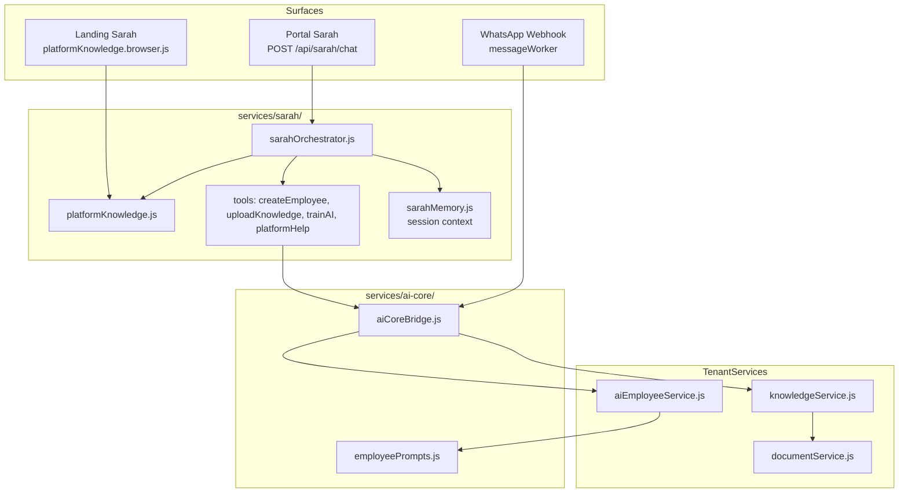

# AI Core — Sarah + AI Employees + Knowledge Base

The AI Core is the integrated intelligence layer of ZiricAI. Sarah (operating assistant), AI Employees (customer-facing agents), and the Knowledge Base (tenant documents) share one coordination bridge.

## Architecture

## Data model

| Entity | Path | Links |
|--------|------|-------|
| AI Employee | `companies/{id}/aiEmployees/{agentId}` | `knowledgeBaseId`, `systemPrompt`, `isDefault` |
| Knowledge Base | `companies/{id}/knowledgeBases/kb-{companyId}` | Auto-created on first upload |
| Document | `companies/{id}/documents/{docId}` | `knowledgeBaseId`, optional `agentId` |

Legacy dual-write to root `agents` and `knowledge` collections continues via storage adapter for backward compatibility.

## Cross-integration flows

### Sarah creates an AI employee

1. User: *"Create a reception AI named Emma"*
2. `createEmployee` tool → `aiCoreBridge.createEmployeeWithKnowledge`
3. `aiEmployeeService.createAiEmployee` with role template prompt
4. `ensureKnowledgeBase(companyId, kb-{companyId})`
5. Response includes links to Agents + Knowledge modules

### Sarah trains / uploads knowledge

1. User: *"Train the Funeral AI with this policy…"*
2. `uploadKnowledge` or `trainAI` → `resolveAiEmployee` by name/role
3. `saveKnowledgeDocument` to employee's `knowledgeBaseId`
4. Session memory stores `lastAgentName`, `lastKnowledgeBaseId`

### Inbound WhatsApp message

1. Webhook → job queue → `messageWorker`
2. `retrieveAgentKnowledgeContext(companyId, text)`
3. Default AI employee loaded via `getDefaultAiEmployee`
4. Keyword RAG-lite from linked KB documents
5. Reply = `agent.systemPrompt` + retrieved context → OpenAI

### Marketplace pack install

1. `installIndustryPack` provisions agents via `provisionAgent`
2. Pack knowledge docs saved via tenant `saveKnowledgeDocument`
3. Each agent links to `kb-{companyId}`

## API routes

| Method | Route | Purpose |
|--------|-------|---------|
| GET | `/api/companies/:companyId/ai-employees` | List tenant AI employees |
| POST | `/api/companies/:companyId/ai-employees` | Create AI employee |
| PATCH | `/api/companies/:companyId/ai-employees/:agentId` | Update AI employee |
| DELETE | `/api/companies/:companyId/ai-employees/:agentId` | Delete AI employee |
| GET | `/api/companies/:companyId/knowledge/documents` | List tenant KB documents |
| DELETE | `/api/companies/:companyId/knowledge/documents/:docId` | Delete document |
| POST | `/api/sarah/chat` | Sarah orchestrator (tools + FAQ) |

## Platform FAQ (single source)

- Canonical: `js/shared/platformKnowledge.js`
- Server re-export: `services/sarah/platformKnowledge.js`
- Landing browser: `js/shared/platformKnowledge.browser.js`

Topics: overview, aiEmployee, pricing, setup, whatsapp, marketplace, integrations, crm, automation, knowledge, sarah, security.

## Future work

- Firestore persistence for Sarah sessions (`sarahMemory.js` strategy documented)
- Vector embeddings for semantic KB search
- Agent versioning / publish workflow
- Remove legacy root collection dual-write
