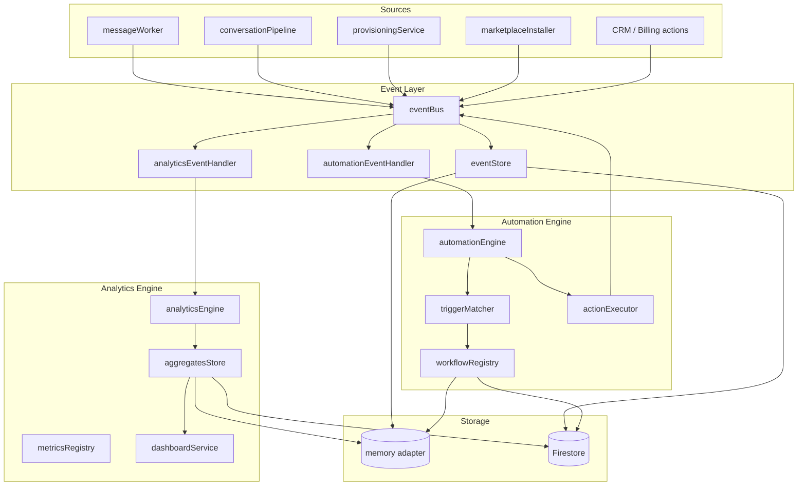

# Analytics & Automation Architecture

Event-driven analytics and automation for ZiricAI multi-tenant platform.

## System Overview



## Event System Flow

1. **Publish** — `publish(companyId, type, payload)` creates a normalized event, persists to `events/{eventId}`, then notifies subscribers.
2. **Analytics handler** — subscribes to `*`, extracts metric deltas via `metricsRegistry`, queues batched aggregate updates.
3. **Automation handler** — subscribes to `*`, matches tenant workflows via `triggerMatcher`, executes actions via `actionExecutor`, emits `AutomationExecuted` (feeds back into analytics).
4. **Async mode** — optional `publish(..., { async: true })` enqueues `PROCESS_EVENT` on `jobQueue`.

### Event Schema

```json
{
  "id": "evt-...",
  "companyId": "demo-central-motors",
  "type": "MessageReceived",
  "timestamp": "2026-07-19T14:00:00.000Z",
  "actorId": null,
  "payload": { "phone": "+27...", "text": "..." },
  "metadata": {},
  "expiresAt": "..."
}
```

### Event Types

| Type | Typical source |
|------|----------------|
| ConversationStarted | messageWorker (new thread) |
| ConversationEnded | CRM / conversation close |
| LeadCaptured | messageWorker (lead score ≥ 60) |
| AppointmentBooked | Sarah / booking tools |
| KnowledgeUploaded | provisioning, marketplace install |
| PaymentReceived / PaymentFailed | billing webhooks |
| MessageSent / MessageReceived | worker / pipeline |
| KnowledgeQuery | messageWorker (KB hit) |
| AutomationExecuted | automationEngine (feedback loop) |
| LeadInactive | scheduled job (48h) |
| SupportTicketCreated | CRM |
| QuotationSent | automation / Sarah |
| ConversionCompleted | CRM |
| MissedOpportunity | intelligence pipeline |

## Automation Trigger / Action Model

### Workflow document

```json
{
  "id": "tpl-pricing-quotation",
  "name": "Pricing enquiry → Send quotation",
  "status": "active",
  "trigger": {
    "eventType": "MessageReceived",
    "match": { "keywords": ["price", "quote"] }
  },
  "actions": [
    { "type": "send_message", "config": { "template": "quotation_followup" } },
    { "type": "send_notification", "config": { "title": "Quotation requested" } }
  ]
}
```

### Built-in templates

- Pricing enquiry → Send quotation
- Appointment booked → Notify staff
- Payment failed → Send reminder
- Lead inactive 48h → Follow up
- Support ticket → Assign agent

### Action types

| Action | Description |
|--------|-------------|
| `send_notification` | Portal notification via storage adapter |
| `send_message` | Outbound via integrationHub (WhatsApp, etc.) |
| `assign_agent` | Assign default AI employee to customer |
| `create_task` | CRM task via customerService |
| `webhook` | POST to `AUTOMATION_WEBHOOK_URL` |

## Database Design

```
companies/{companyId}/
  events/{eventId}              — raw events (TTL 90 days via expiresAt)
  analyticsDaily/{date}         — daily rollups (maps to analytics/daily/{date})
  analyticsHourly/{hour}        — hourly rollups
  analyticsMetrics/current      — live counters
  automations/{workflowId}      — tenant + built-in workflows
  automationRuns/{runId}        — execution log
```

Memory adapter mirrors the same structure via `TenantRepository` + `saveAnalyticsRollup`.

### Firestore indexes (collection group)

Add to `firestore.indexes.json`:

- `events`: `companyId ASC, timestamp DESC`
- `events`: `companyId ASC, type ASC, timestamp DESC`
- `automationRuns`: `companyId ASC, startedAt DESC`

## API Routes

| Method | Path | Description |
|--------|------|-------------|
| GET | `/api/analytics/dashboard/:companyId` | Full BI snapshot |
| GET | `/api/analytics/events/:companyId` | Paginated events (`?limit=&cursor=&type=`) |
| GET | `/api/analytics/popular-questions/:companyId` | Top KB questions |
| GET | `/api/automations/:companyId` | List workflows |
| POST | `/api/automations/:companyId` | Create/update workflow |
| POST | `/api/automations/:companyId/:workflowId/run` | Manual trigger |
| GET | `/api/automations/:companyId/runs` | Execution log |

Portal hub (`/api/portal/hub/:companyId`) merges live analytics KPIs into overview metrics.

## Performance Optimization

1. **Event batching** — aggregates flush every `ANALYTICS_BATCH_SIZE` (default 25) events or `ANALYTICS_FLUSH_MS` (default 30s).
2. **Daily rollups** — dashboard queries read `analyticsDaily/*` and `analyticsMetrics/current`, not raw events.
3. **Pagination** — event log uses cursor-based pagination (`nextCursor`).
4. **Async handlers** — optional `publish(..., { async: true })` defers to `jobQueue`.
5. **TTL** — raw events include `expiresAt` (90 days); prune on read in dev, Firestore TTL policy in prod.

## Scalability Strategy

| Strategy | Implementation |
|----------|----------------|
| Tenant sharding | All paths keyed by `companyId` — natural Firestore partition |
| Rollup jobs | Nightly cron (future) recomputes `analyticsDaily` from events |
| Event TTL | 90-day retention on raw events |
| Collection groups | Cross-tenant ops use indexed collection-group queries |
| Queue scaling | Swap in-process `jobQueue` for BullMQ/SQS without API changes |
| Hot counters | `analyticsMetrics/current` doc per tenant for O(1) KPI reads |

## Environment Variables

| Variable | Default | Purpose |
|----------|---------|---------|
| `STORAGE_BACKEND` | `auto` | `memory` for local dev |
| `ANALYTICS_BATCH_SIZE` | `25` | Events before aggregate flush |
| `ANALYTICS_FLUSH_MS` | `30000` | Max batch window |
| `AUTOMATION_WEBHOOK_URL` | — | External webhook action target |

## File Map

```
services/events/
  eventBus.js, eventTypes.js, eventStore.js
  analyticsEventHandler.js, automationEventHandler.js, index.js

services/analytics/
  analyticsEngine.js, aggregatesStore.js, metricsRegistry.js
  dashboardService.js, analyticsService.js, tenantAnalyticsService.js

services/automation/
  automationEngine.js, workflowRegistry.js, triggerMatcher.js, actionExecutor.js
```
