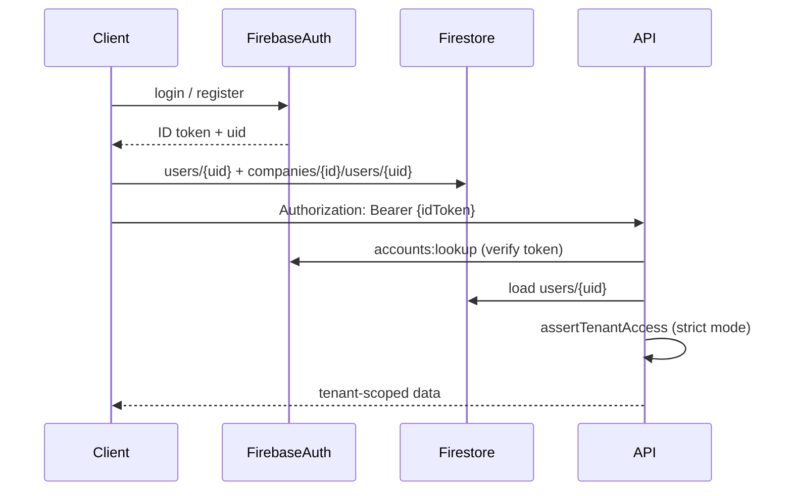

# Authentication Architecture

ZiricAI uses **Firebase Authentication** for identity and **Firestore** for profiles and tenant membership. The Express API validates Firebase ID tokens and enforces tenant scope via `requireTenantScope`.

## Flow overview



## Environment variables

| Variable | Default | Description |
|----------|---------|-------------|
| `TENANT_SCOPE_ENFORCEMENT` | `lax` | `strict` requires Bearer token + matching `profile.companyId` + membership doc |
| `MFA_ENFORCEMENT` | `off` | `strict` blocks API when `profile.mfaEnabled` is false |
| `FIREBASE_API_KEY` | from `js/firebase.js` | Used server-side for `verifyIdToken` |
| `STORAGE_BACKEND` | `auto` | `memory` for demo; `firestore` for production profiles |

## Strict vs lax mode

### Lax (development / demo)

- API routes accept requests without Bearer token
- Portal auth-guard falls back to `resolveDemoProfile()` when Firestore profile is missing
- Cross-tenant checks are skipped
- Demo company: `demo-central-motors`

### Strict (production)

Set:

```bash
TENANT_SCOPE_ENFORCEMENT=strict
```

Requirements:

1. Client sends `Authorization: Bearer <firebase-id-token>` on all tenant API calls (`js/shared/apiRequest.js`)
2. `users/{uid}` profile exists with `companyId`
3. `companies/{companyId}/users/{uid}` membership doc exists
4. Route `companyId` must match profile `companyId`
5. Super Admin bypasses tenant checks but must use Super Admin console routes

Cross-tenant access returns **403** with codes:

- `TENANT_FORBIDDEN` — profile company mismatch
- `MEMBERSHIP_REQUIRED` — membership doc missing
- `PROFILE_REQUIRED` — no global profile
- `UNAUTHORIZED` — no valid Bearer token

## Roles

| Role | Portal | Super Admin | Typical permissions |
|------|--------|-------------|---------------------|
| `owner` | Yes | No | Full company access |
| `manager` | Yes | No | Staff, AI, exports |
| `sales`, `support`, `reception` | Yes | No | Inbox |
| `marketing` | Yes | No | AI, knowledge |
| `finance` | Yes | No | Billing, exports |
| `superadmin` | Redirect | Yes | Platform-wide |

Role checks are shared between:

- Client: `js/portal/permissions.js`
- Server: `services/auth/permissionsService.js`

Sensitive routes use `checkPermission()` middleware (e.g. knowledge upload → `canUploadKnowledge`).

## Signup & onboarding

1. Client: `registerUser()` → Firebase Auth user
2. Client: `startOnboarding()` → provisions company workspace
3. Client + server: write `users/{uid}` with `companyId` and role `owner`
4. Client + server: write `companies/{companyId}/users/{uid}` membership

Helper: `registerUserWithProfile()` in `js/auth.js` for unified client signup.

## Sessions

- **Client:** Firebase `onAuthStateChanged` + automatic token refresh via `getIdToken()`
- **Server:** `services/auth/sessionService.js` tracks active sessions in memory (demo)
- **Production path (documented):** `users/{uid}/sessions/{sessionId}` in Firestore

API:

- `GET /api/auth/session` — returns profile, `companyId`, role, enforcement mode
- `POST /api/auth/logout` — invalidates server session hook; client calls Firebase `signOut`

## MFA (scaffold)

Full TOTP via Firebase Multi-Factor Auth is planned. Current scaffold:

- Profile field: `mfaEnabled` (boolean) on `users/{uid}`
- UI stub on `auth-test.html` (enrollment placeholder)
- Server: `MFA_ENFORCEMENT=strict` checks `mfaEnabled` in `assertTenantAccess`

Future: Firebase `multiFactor.enroll()` with TOTP; settings page enrollment in Company Portal.

## Firestore security rules

- `users/{uid}` — read/write own profile; superadmin read all
- `users/{uid}/sessions/{sessionId}` — own sessions only
- `companies/{companyId}/users/{memberId}` — members read; create own membership when `userCompanyId() == companyId`
- Tenant subcollections gated by membership doc or superadmin

## Strict mode test steps

1. Start server with strict enforcement:

   ```bash
   TENANT_SCOPE_ENFORCEMENT=strict node server.js
   ```

2. Complete onboarding or create test user with profile + membership for company `acme-xxxx`.

3. Sign in via `auth-test.html` or Company Portal.

4. **Session test:**

   ```bash
   # Get token from browser console: await firebase.auth().currentUser.getIdToken()
   curl -H "Authorization: Bearer YOUR_TOKEN" http://localhost:3000/api/auth/session
   ```

   Expect: `{ uid, email, role, companyId, profile, enforcement: "strict" }`

5. **Cross-tenant test:**

   ```bash
   curl -H "Authorization: Bearer YOUR_TOKEN" \
     http://localhost:3000/api/portal/company/demo-central-motors
   ```

   Expect: **403** `TENANT_FORBIDDEN` if profile `companyId` differs.

6. **No token test:**

   ```bash
   curl http://localhost:3000/api/portal/company/YOUR_COMPANY_ID
   ```

   Expect: **401** `UNAUTHORIZED` in strict mode.

7. **Demo mode regression:**

   ```bash
   STORAGE_BACKEND=memory TENANT_SCOPE_ENFORCEMENT=lax node server.js
   ```

   Portal login without Firestore profile should still work via demo fallback.

## Key files

| Area | Files |
|------|-------|
| Client auth | `js/auth.js`, `js/users.js` |
| API Bearer | `js/shared/apiRequest.js` |
| Portal guard | `js/portal/auth-guard.js` |
| Admin guard | `js/admin/auth-guard.js` |
| Permissions | `js/portal/permissions.js`, `services/auth/permissionsService.js` |
| Server auth | `services/auth/authService.js`, `services/auth/sessionService.js` |
| Tenant scope | `services/core/tenantContext.js` |
| Rules | `firestore.rules` |
