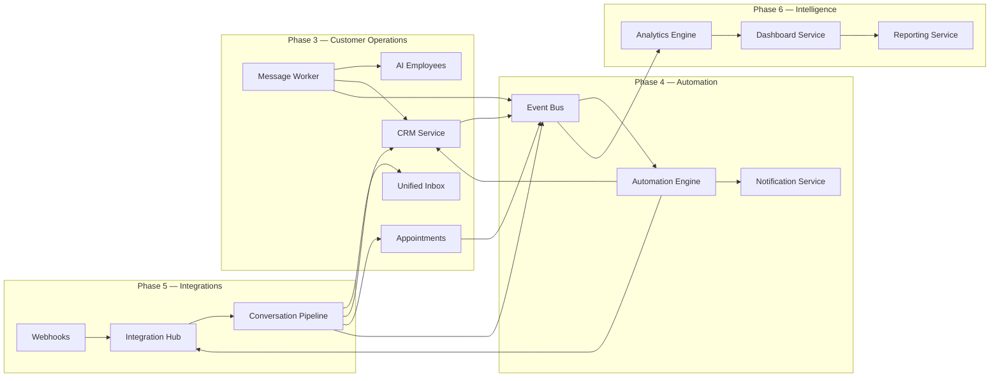

# Customer Operations Architecture (Phases 3–6)

ZiricAI Customer Operations stack integrates CRM, Unified Inbox, Appointments, Automation, Integrations, Analytics, and Reporting into a single event-driven flow under `companies/{companyId}/`.

## System Flow



## Event Types (cross-phase)

| Event | Publisher | Consumers |
|-------|-----------|-----------|
| `MessageReceived` | Conversation Pipeline | Analytics, Automation |
| `LeadCaptured` | CRM / Message Worker | Analytics, Automation |
| `AppointmentBooked` | Appointments API / Sarah | Analytics, Automation |
| `AutomationExecuted` | Automation Engine | Analytics |
| `PaymentFailed` | Integrations (stub) | Automation |

## Tenant Data Paths

```
companies/{companyId}/
  contacts/          # CRM contacts
  leads/             # Pipeline leads
  customers/         # Promoted customers
  conversations/     # Unified inbox metadata
  appointments/      # Scheduling
  tasks/             # CRM + automation tasks
  notifications/     # In-app alerts
  automations/       # Workflow definitions
  automationRuns/    # Execution log
  analyticsDaily/    # BI aggregates
```

## API Surface (tenant-scoped)

### Phase 3 — Customer Operations
- `GET/POST /api/companies/:companyId/crm/*` — customers, leads, contacts, pipeline, tasks, timeline
- `GET/POST /api/companies/:companyId/conversations` — unified inbox, reply, human takeover
- `GET/POST /api/companies/:companyId/appointments` — CRUD + cancel

### Phase 4 — Automation
- `GET/POST /api/automations/:companyId` — workflow registry (tenant `automations/`)
- `GET /api/automations/:companyId/runs` — execution log
- Automation actions: `send_message`, `notify`, `create_task`, `update_crm`, `assign_agent`

### Phase 5 — Integrations
- `POST /webhooks/:channel/:companyId` — unified inbound
- `GET /api/integrations/health` — channel status matrix
- `GET /api/integrations/channels/:companyId` — portal connect UI

### Phase 6 — Intelligence
- `GET /api/analytics/dashboard/:companyId` — BI + AI insights
- `GET /api/companies/:companyId/reports/weekly` — JSON/HTML/CSV reports

## Portal Modules

| Module | API | Notes |
|--------|-----|-------|
| Inbox | `/conversations` | Channel badges: WhatsApp, FB, IG, Telegram, Web, Email, SMS |
| CRM | `/crm/*` | Pipeline view, tenant customers |
| Appointments | `/appointments` | Book form + calendar list |
| Automation | `/automations/:id` | Workflows + run log |
| Integrations | `/integrations/channels` | Connect CTAs (stubs) |
| Analytics | `/analytics/dashboard` | AI insights + download report |
| Notifications | `/notifications` | Mark-all-read |

## Portal Data Hub

`GET /api/portal/hub/:companyId` aggregates:
- CRM customer + lead counts
- Inbox unread count
- Appointments today / upcoming
- Automation recent runs
- Analytics KPIs from live aggregates

## Dev / Memory Backend

Set `STORAGE_BACKEND=memory` for local dev. Demo seed:
- `seedDemoCustomers.js` — legacy CRM profiles
- `seedCustomerOpsDemo.js` — tenant leads + appointments

## Sarah Tools

- `bookAppointment` → `appointmentService` + `AppointmentBooked` event
- `generateReport` → `reportService` + download link

## Connector Stubs (Phase 5)

Google Calendar, Microsoft 365, Stripe, Paystack, Facebook, Instagram, Telegram, Email, SMS — configured via Integration Hub adapters with "Connect" UX in portal; WhatsApp is production-ready when env vars are set.
