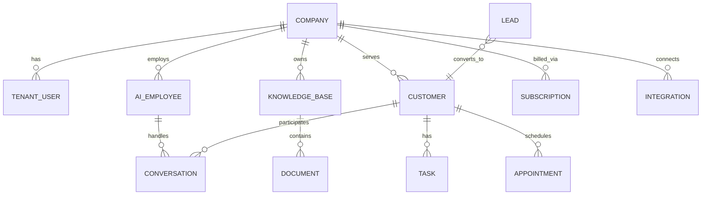

# Firestore Multi-Tenant Schema

All tenant data is namespaced under `companies/{companyId}`. Constants live in `services/database/schema.js`.

## Root Collections

| Path | Purpose | Access |
|------|---------|--------|
| `users/{uid}` | Global auth profile (Firebase uid) | Own doc + superadmin |
| `companies/{companyId}` | Tenant root metadata | Company members + superadmin |

## Tenant Subcollections

Path pattern: `companies/{companyId}/<collection>/{docId}`

| Subcollection | Document ID | Key Fields | Relationships |
|---------------|-------------|------------|---------------|
| `users` | Firebase uid | `uid`, `email`, `fullName`, `role`, `departmentId`, `status`, `companyId` | Links to global `users/{uid}` |
| `roles` | auto | `name`, `permissions[]`, `companyId` | Referenced by tenant users |
| `departments` | auto | `name`, `headUid`, `companyId` | Users.departmentId |
| `aiEmployees` | agent id | `name`, `role`, `model`, `systemPrompt`, `knowledgeBaseId`, `isDefault`, `status` | → knowledgeBases, conversations |
| `knowledgeBases` | `kb-{companyId}` | `name`, `status`, `companyId` | → documents |
| `conversations` | phone or uuid | `customerId`, `channel`, `status`, `lastMessage`, `assignedAgentId` | → customers, messages subcollection |
| `contacts` | auto | `name`, `email`, `phone`, `source`, `companyId` | May promote to leads/customers |
| `leads` | auto | `name`, `phone`, `leadScore`, `stage`, `source` | → customers on conversion |
| `customers` | normalized phone | `phone`, `name`, `leadScore`, `tags[]`, `status`, `assignedAiEmployee` | → messages subcollection |
| `appointments` | auto | `customerId`, `scheduledAt`, `status`, `assignedTo` | → customers |
| `tasks` | auto | `title`, `status`, `priority`, `dueAt`, `assignedTo`, `customerId?` | → customers (optional) |
| `automations` | auto | `name`, `workflowId`, `status`, `trigger` | → workflow engine |
| `analytics` | auto/event id | `event`, `payload`, `recordedAt` | Aggregated in portal |
| `billing` | companyId | `planId`, `usage`, `periodStart`, `periodEnd` | → subscriptions |
| `subscriptions` | auto | `planId`, `status`, `stripeCustomerId?`, `renewalAt` | → billing |
| `integrations` | auto | `provider`, `status`, `config` (encrypted server-side) | WhatsApp, OpenAI, etc. |
| `notifications` | auto | `type`, `title`, `message`, `read`, `createdAt` | Portal inbox |
| `documents` | auto | `title`, `type`, `content`, `knowledgeBaseId`, `fileName` | → knowledgeBases |
| `files` | auto | `name`, `mimeType`, `sizeBytes`, `storagePath`, `uploadedBy` | Firebase Storage ref |
| `settings` | setting key | `profile`, `provisioning`, `branding` | Tenant config blobs |
| `provisioning` | `links` | `links`, `resources[]`, `provisionedAt` | Internal provisioning state |

### Nested Subcollections

```
companies/{companyId}/customers/{customerId}/messages/{messageId}
companies/{companyId}/conversations/{convId}/messages/{messageId}
```

## Company Root Document Fields

```javascript
{
  id: string,
  name: string,
  industry: string,
  plan: "trial" | "starter" | "business" | "enterprise",
  status: "active" | "trial" | "suspended" | "archived",
  email: string,
  phone: string,
  website: string,
  ownerUid: string,
  ownerEmail: string,
  whatsappNumber: string,
  whatsappConnected: boolean,
  branding: { primaryColor, whatsappGreeting, logoUrl? },
  createdAt: timestamp,
  updatedAt: timestamp,
  provisionedAt: timestamp
}
```

## Legacy Collections (Phase 1 — deprecating)

These flat root collections remain for backward compatibility:

- `customers/{phone}` + `messages` subcollection
- `agents/{agentId}`
- `knowledge/{docId}`
- `conversations/{id}`
- `analytics/{id}`
- `billing/{id}`
- `memories/{id}`

Server-side writes continue via `firestoreAdapter` / `memoryAdapter`. New code should use tenant subcollections.

## Required Composite Indexes

Defined in `firestore.indexes.json`:

| Collection Group | Fields | Use Case |
|------------------|--------|----------|
| `customers` | `status ASC, lastSeen DESC` | Inbox filtering |
| `customers` | `companyId ASC, lastSeen DESC` | Cross-tenant admin (collection group) |
| `conversations` | `status ASC, updatedAt DESC` | Active conversations |
| `tasks` | `status ASC, dueAt ASC` | Task queue |
| `notifications` | `read ASC, createdAt DESC` | Unread notifications |
| `leads` | `leadScore DESC, updatedAt DESC` | Lead prioritization |
| `aiEmployees` | `isDefault DESC, updatedAt DESC` | Default agent lookup |
| `appointments` | `status ASC, scheduledAt ASC` | Calendar view |
| `documents` | `knowledgeBaseId ASC, updatedAt DESC` | KB document list |

## Pagination Pattern

```javascript
// TenantRepository.list(companyId, { max: 50, orderByField: 'updatedAt', startAfterDoc })
// Always scope by path: companies/{companyId}/<collection>
// Use cursor-based pagination with startAfter for large tenants
```

## Relationships Diagram


