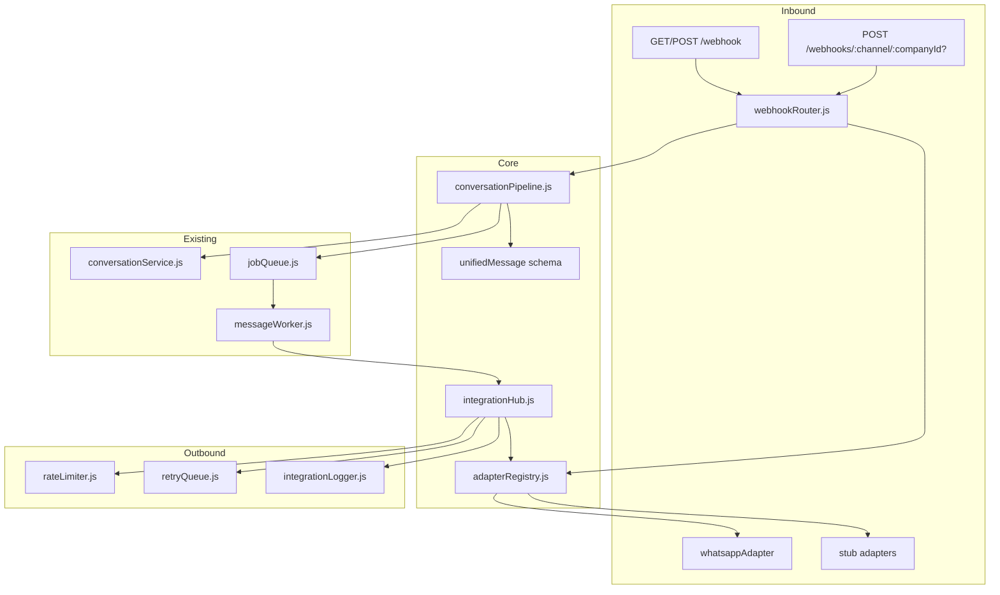

# Integration Hub

Unified communication layer for ZiricAI. All messaging channels and third-party connectors route through a single adapter registry, conversation pipeline, and webhook router.

## Architecture



## Adapter Interface

All messaging adapters extend `BaseAdapter` (`services/integrations/adapters/baseAdapter.js`):

| Method | Purpose |
|--------|---------|
| `getChannelType()` | Channel identifier (`whatsapp`, `facebook`, …) |
| `isConfigured(ctx)` | Whether credentials exist for tenant |
| `sendMessage(ctx, payload)` | Outbound `{ to, text, media? }` |
| `receiveMessage(ctx, rawPayload)` | Parse webhook → `UnifiedMessage` |
| `getProfile(ctx, userId)` | Sender profile lookup |
| `uploadMedia(ctx, media)` | Upload attachment |
| `downloadMedia(ctx, mediaId)` | Download attachment |
| `webhookHandler(req, res, ctx)` | Express handler (verify + ingest) |
| `validateWebhook(req)` | Signature / token validation |

Connectors (calendar, payments) use the same base class with stub implementations.

## Unified Message Schema

```javascript
{
  companyId: "demo-central-motors",
  channel: "whatsapp",
  externalId: "wamid.xxx",
  from: "27821234567",
  to: "PHONE_NUMBER_ID",
  text: "Hello",
  media: [],
  timestamp: "2026-07-19T14:00:00.000Z",
  metadata: { messageType: "text", contactName: "Jane" }
}
```

## Webhook Strategy

| Route | Purpose |
|-------|---------|
| `GET/POST /webhook` | **Legacy** Meta WhatsApp — unchanged URL for existing Meta app config |
| `GET /webhooks/:channel` | Channel verification (stub channels return JSON status) |
| `POST /webhooks/:channel` | Inbound events, tenant from phone_number_id mapping or `DEFAULT_COMPANY_ID` |
| `POST /webhooks/:channel/:companyId` | Explicit tenant scoping in URL |

**Flow:** webhook → `validateWebhook` → `adapter.receiveMessage` → `conversationPipeline.ingest` → `conversationService` + `jobQueue` → `messageWorker` → `integrationHub.sendMessage`.

## Security

1. **Webhook signatures** — WhatsApp validates `X-Hub-Signature-256` when `META_APP_SECRET` or `APP_SECRET` is set.
2. **Tenant isolation** — `companyId` from URL path, `x-company-id` header, or `phone_number_id → companyId` map (`integrationConfig.js`).
3. **Tenant context** — Portal/API routes use `requireTenantScope()` from `services/core/tenantContext.js`.
4. **Rate limiting** — Token bucket per `companyId + channel` (in-memory demo).

## Rate Limiting

`rateLimiter.js` implements an in-memory token bucket:

- Default: 60 msg/min for WhatsApp, 30/min for social channels
- Throws `RateLimitError` with `retryAfterMs` when exhausted
- Outbound sends checked before adapter dispatch

## Retry Queue

Failed `sendMessage` calls schedule up to **3 retries** with exponential backoff (1s, 2s, 4s). Failures logged via `integrationLogger`.

## Monitoring Endpoints

| Endpoint | Description |
|----------|-------------|
| `GET /api/integrations/health?companyId=` | All channel statuses + retry queue stats |
| `GET /api/integrations/channels/:companyId` | Channel connection status for portal |
| `GET /api/integrations/logs/:companyId?limit=50&channel=` | Recent integration events (in-memory ring buffer) |

## Folder Structure

```
services/integrations/
  integrationHub.js
  adapterRegistry.js
  conversationPipeline.js
  webhookRouter.js
  retryQueue.js
  integrationLogger.js
  rateLimiter.js
  errors.js
  adapters/
    baseAdapter.js
    whatsappAdapter.js      ← wraps services/whatsapp.js
    facebookAdapter.js      ← stub
    instagramAdapter.js
    telegramAdapter.js
    webchatAdapter.js
    emailAdapter.js
    smsAdapter.js
    stubFactory.js
  connectors/
    googleCalendarAdapter.js
    microsoft365Adapter.js
    stripeAdapter.js
    paystackAdapter.js
    firebaseAdapter.js
    stubConnectorFactory.js
  types/
    unifiedMessage.js
    integrationConfig.js
```

## Migration from WhatsApp-Only Flow

| Before | After |
|--------|-------|
| Inline logic in `server.js` POST `/webhook` | `handleLegacyWhatsAppWebhook` → `whatsappAdapter` |
| Direct `sendWhatsAppMessage` in worker | `integrationHub.sendMessage('whatsapp', …)` |
| No channel abstraction | Adapter registry + stubs for future channels |
| No retry on send failure | `retryQueue` with backoff |
| Console-only logging | Structured `[integration][channel][companyId]` logs |

**Backward compatibility:** Meta webhook URL stays `https://<host>/webhook`. No changes required to Meta Developer Console.

## Environment Variables

| Variable | Purpose |
|----------|---------|
| `VERIFY_TOKEN` | Meta webhook verification |
| `PHONE_NUMBER_ID` | WhatsApp Business phone ID |
| `WHATSAPP_TOKEN` | Meta Graph API token |
| `META_APP_SECRET` / `APP_SECRET` | Webhook signature validation |
| `DEFAULT_COMPANY_ID` | Fallback tenant for single-tenant / demo |
| `STORAGE_BACKEND=memory` | Works with in-memory storage (no Firestore required) |

## Testing WhatsApp

1. Start server: `STORAGE_BACKEND=memory node server.js`
2. Verify health: `GET /api/integrations/health` — `whatsapp.configured: true` when env vars set
3. Meta verification: `GET /webhook?hub.mode=subscribe&hub.verify_token=<VERIFY_TOKEN>&hub.challenge=test`
4. Send test message to business number — console shows `[integration][whatsapp] Pipeline ingest`
5. Worker replies via adapter — `[integration][whatsapp] Outbound send`
6. Confirm legacy path: inbound still hits `/webhook`, not `/webhooks/whatsapp`

## Stub Channels

Unconfigured messaging adapters and connectors return:

```json
{
  "stub": true,
  "message": "Connect facebook in Settings → Integrations to enable outbound messaging."
}
```

Portal Integrations module reads live status from `GET /api/integrations/channels/:companyId`.
