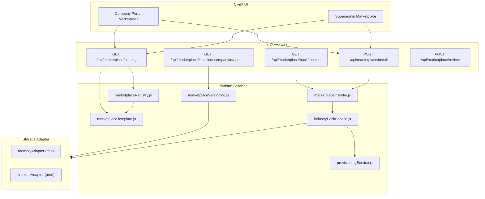
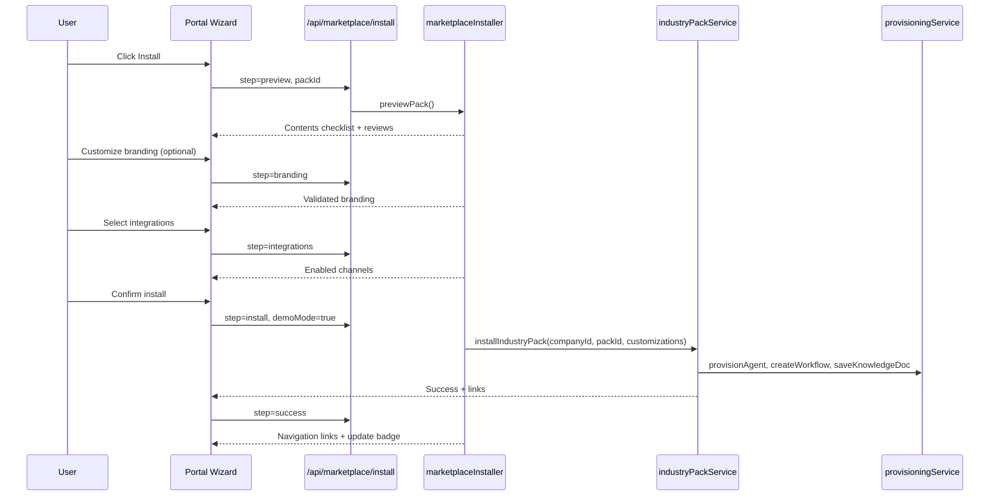
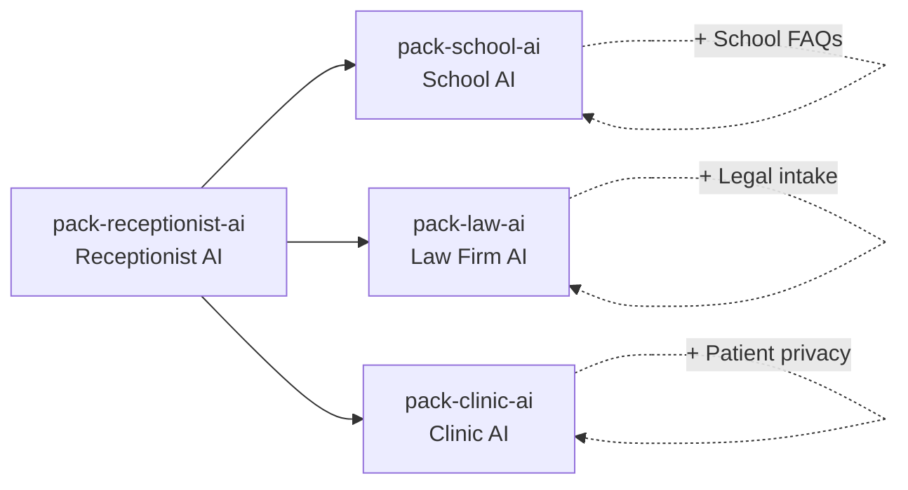

# ZiricAI Marketplace Architecture

One-click install of complete AI Employee packs — knowledge, flows, automations, integrations, prompts, FAQs, actions, and analytics — in under 5 minutes.

## System Overview



## Installation Workflow (5 Steps)



| Step | Name | Backend | Purpose |
|------|------|---------|---------|
| 1 | Preview | `previewPack()` | Contents checklist, rating, reviews, inheritance chain |
| 2 | Branding | `validateBranding()` | Optional agent name, greeting, colors |
| 3 | Integrations | `selectIntegrations()` | Enable WhatsApp, email, webchat, etc. |
| 4 | Install | `executeInstall()` | Provision all tenant resources + **post-install validation** |
| 5 | Success | `installSuccess()` | Links to Agents, Knowledge, Automation |

## Install validation

After `installIndustryPack()` completes, `marketplaceInstallValidator.validatePackInstall()` verifies resources exist in tenant APIs before the install is marked successful:

| Check | Tenant API | Requirement |
|-------|------------|-------------|
| AI employees | `listAiEmployees(companyId)` | Each provisioned agent has `systemPrompt` + `knowledgeBaseId` |
| Knowledge docs | `listKnowledgeDocuments(companyId)` | All `knowledgeDocIds` from install record resolve |
| Automations | `listWorkflows(companyId)` via `workflowRegistry` | Pack workflows saved as `status: active` with event triggers |

If validation fails, `executeInstall()` throws and the UI shows the error — broken templates are not marked installed.

Workflows from pack manifests are converted from node graphs to automation engine `trigger` + `actions` (not legacy `workflowService` in-memory store).

Success response includes `validation.verified` and `verifiedSummary` (e.g. `Installed: Emma (AI), 3 docs, 1 workflow`).

Portal/admin install flows call `invalidateHub()` + `prefetchHub()` after success so Overview widgets reflect new resources immediately.

## Template Inheritance

Base **Receptionist AI** (`pack-receptionist-ai`) provides shared front-desk knowledge, CRM stages, and enquiry workflow. Industry variants extend it:



**Merge rule:** Child packs inherit base knowledge and workflows; child-specific FAQs and prompts override/append. See `TEMPLATE_INHERITANCE` in `services/platform/marketplaceTemplate.js`.

## Version Management

- Packs use **semver** (e.g. `1.0.0`, `1.1.0`)
- Platform stores full templates at `platform/marketplace/packs/{packId}/versions/{version}`
- `checkForUpdates(companyId, packId)` compares installed version vs latest
- `applyUpdate(companyId, packId, targetVersion)` uses **merge strategy**:
  - **Preserve:** tenant branding, custom KB docs, disabled integrations
  - **Add:** new knowledge docs and workflows from update
  - **Update:** agent prompts and analytics defaults

## Paid vs Free Templates

| Price | Behavior |
|-------|----------|
| `0` | Free — instant install |
| `999` | Paid (demo) — returns 402 unless `demoMode: true` |

Paid packs show "Contact sales" in UI; demo tenants auto-install with `demoMode: true`.

## Flagship Marketplace Items

| Pack ID | Display Name | Category | Price |
|---------|--------------|----------|-------|
| `pack-school-ai` | School AI | Education | Free |
| `pack-law-ai` | Law Firm AI | Legal | Paid |
| `pack-clinic-ai` | Clinic AI | Healthcare | Free |
| `pack-funeral-ai` | Funeral AI | Funeral | Free |
| `pack-sales-ai` | Sales AI | Sales | Paid |
| `pack-receptionist-ai` | Receptionist AI | Hospitality | Free |
| `pack-church-ai` | Church AI | Faith | Free |
| `pack-construction-ai` | Construction AI | Construction | Paid |
| `pack-security-ai` | Security AI | Security | Paid |
| `pack-restaurant-ai` | Restaurant AI | Food | Free |
| `pack-automotive-ai` | Automotive AI | Automotive | Paid |
| `pack-retail-ai` | Retail AI | Retail | Free |

Legacy IDs (`pack-school-receptionist`, `pack-automotive`, etc.) resolve via `PACK_ALIASES` — existing installs are not broken.

## Pack Contents Manifest

Every pack exposes a normalized `contents` object:

```json
{
  "knowledge": ["Admissions Process", "..."],
  "flows": ["Parent Enquiry Intake"],
  "automations": ["Parent Enquiry Intake"],
  "integrations": ["whatsapp", "email"],
  "prompts": ["School Receptionist System Prompt"],
  "faqs": ["FAQ — School Fees & Payment"],
  "actions": ["Book Appointment", "Transfer to Human"],
  "analytics": ["admission_enquiries", "response_time"]
}
```

## Key Files

| File | Role |
|------|------|
| `services/platform/marketplaceRegistry.js` | Pack catalog, categories, aliases |
| `services/platform/marketplaceTemplate.js` | Inheritance, manifest, pricing, ratings |
| `services/platform/marketplaceInstaller.js` | 5-step wizard, search/filter, reviews, validation gate |
| `services/platform/marketplaceInstallValidator.js` | Post-install employee + KB + workflow verification |
| `services/platform/marketplaceVersioning.js` | Semver, updates, merge apply |
| `services/platform/industryPackService.js` | Install orchestration |
| `services/platform/employeePacks.js` | Role-based pack definitions |
| `services/database/schema.js` | Firestore path constants |
| `docs/architecture/MARKETPLACE_SCHEMA.md` | Database schema detail |
