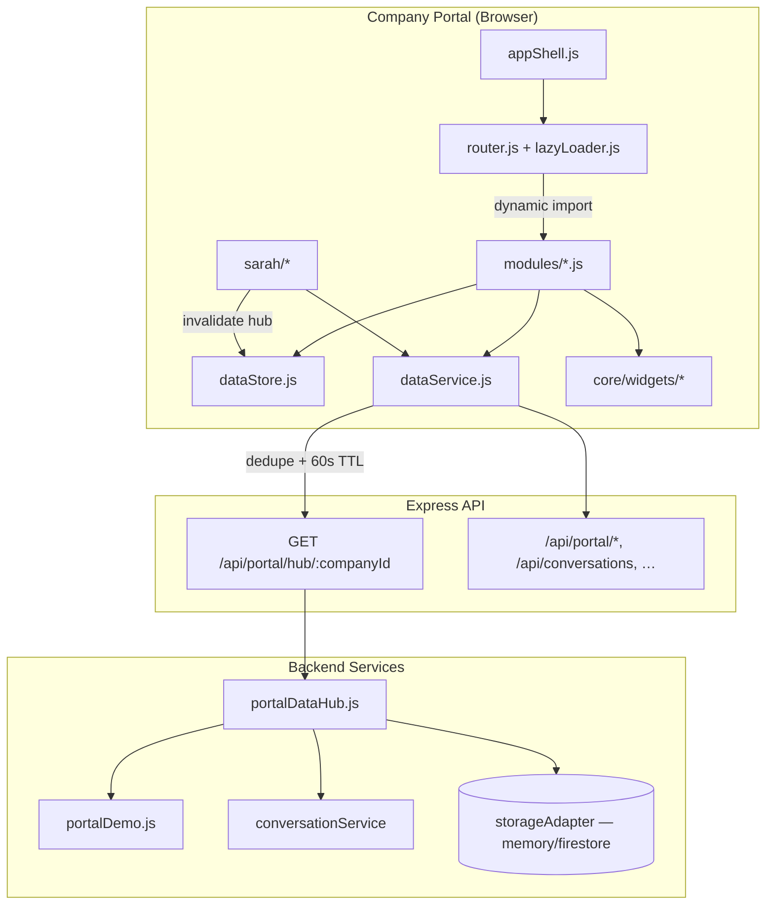

# Company Portal — Business Operating System (BOS)

The Company Portal is refactored into an interconnected **Business Operating System**: shared data hub, centralized state, lazy-loaded modules, and reusable widgets. Super Admin console, auth, Sarah, onboarding, and tenant scoping are unchanged.

## Architecture



## Folder structure

```
js/portal/
  core/
    appShell.js          — sidebar sections, breadcrumb, mobile drawer, badges
    dataStore.js         — state + hubData + subscribe/notify + cache invalidation
    dataService.js       — fetch dedupe, 60s TTL, prefetchHub()
    lazyLoader.js        — dynamic import(`./modules/${id}.js`)
    widgets/
      kpiCard.js
      liveStatCard.js
      conversationPreview.js
      activityFeed.js
      quickActions.js
      emptyState.js
      loadingSkeleton.js
  modules/               — feature pages (lazy-loaded)
  sarah/                 — unchanged Sarah assistant
  state.js               — legacy state object (extended by dataStore)
  router.js, main.js, auth-guard.js, permissions.js, api.js

services/portal/
  portalDataHub.js       — unified hub snapshot for Overview
  portalDemo.js          — demo/provisioned tenant data
```

## Reusable widgets

| Widget | Purpose |
|--------|---------|
| `liveStatCard` | Live KPI with pulse, trend, optional `data-nav` cross-link |
| `kpiCard` | Super Admin–style metric card |
| `conversationPreview` | Recent inbox list with channel/status |
| `activityFeed` / `activityPanel` | Tenant activity stream |
| `quickActions` | Horizontal action bar (Create AI, Upload KB, …) |
| `loadingSkeleton` | Shimmer loader for lazy module transitions |
| `emptyState` | Consistent empty panels |

## State management

- **Single source of truth:** `core/dataStore.js` wraps `state.js` and adds `hubData`, `moduleCache`, `hubFetchedAt`.
- **Subscribe/notify:** `subscribe('hubData' | 'unreadNotifications', fn)` for shell badges and widgets.
- **Invalidation:** `invalidateCache('hub')` or `dataService.invalidateHub()` on manual refresh or Sarah tool success.

## Performance

| Technique | Location |
|-----------|----------|
| Request deduplication | `dataService.js` — in-flight `Map` |
| 60s hub TTL | `prefetchHub()` / `getHubData()` |
| Lazy module imports | `lazyLoader.js` + `router.js` |
| Prefetch on login | `auth-guard.js` → `prefetchHub(companyId)` |
| Prefetch adjacent modules | `router.navigateTo` → conversations, customers, notifications |
| CSS containment / shimmer | `company-portal.css` — `contain: layout style`, skeleton animations |

## Hub API

`GET /api/portal/hub/:companyId` returns:

- `metrics` — conversations today, appointments, leads, revenue, AI accuracy, response time, satisfaction, missed chats
- `recentConversations` — inbox preview (from tenant conversation service)
- `recentActivity`, `notifications`, `usage`, `quickStats`, `chartSeries`
- `isDemo` — true only for `demo-central-motors` without provisioned profile; all other tenants use live counts or zeros

Works with `STORAGE_BACKEND=memory`.

## Live widget data sources

| Dashboard widget | Hub field | Backend source |
|------------------|-----------|----------------|
| Today's Conversations | `metrics.conversationsToday` | `conversationService` + analytics daily aggregates |
| Appointments Booked | `metrics.appointmentsBooked` | `appointmentService` + analytics KPIs |
| Leads Captured | `metrics.leadsCaptured` | `crmService.listLeads` |
| Revenue Generated | `metrics.revenueGenerated` | Analytics aggregates / billing events |
| AI Accuracy | `metrics.aiAccuracy` | Analytics `aggregatesStore` current metrics |
| Response Time | `metrics.responseTimeSec` | Analytics response-time rollups |
| Customer Satisfaction | `metrics.customerSatisfaction` | Analytics satisfaction aggregates |
| Missed Chats | `metrics.missedChats` | Analytics `missedOpportunities` |
| Recent Conversations | `recentConversations` | `listTenantConversations` (empty list when no data) |
| Activity Feed | `recentActivity` | Tenant notifications / automation runs (demo activity only for `demo-central-motors`) |
| Usage Snapshot | `usage`, `metrics.activeConversations` | `portalDemo.getPortalUsageAsync` + workspace counts |
| CRM / Knowledge KPIs | `metrics.customersTotal`, `metrics.knowledgeItems` | CRM list + workspace resource counts |

**Empty tenant behavior:** KPIs show `0` or `—` (not seeded hash values). Panels use `emptyState` widget.

**Hub refresh triggers:** login (`prefetchHub`), manual refresh, Sarah tool success, marketplace install, conversation reply sent.

## Navigation UX

- **Sidebar:** Collapsible sections (Operate / Grow / Administration) — Notion-like grouping
- **Top bar:** Company breadcrumb, Sarah button, notification bell, user menu
- **Badges:** Unread notification count on bell + nav item
- **Mobile:** Hamburger opens drawer sidebar; KPI grid stacks

## Dashboard sections

| Nav item | Module | Status |
|----------|--------|--------|
| Overview | `dashboard.js` | Full BOS refactor + hub data |
| AI Employees | `agents.js` | Existing logic, shared styling |
| Knowledge Base | `knowledge.js` | Existing |
| Conversations | `conversations.js` | Uses hub cache + dataService |
| CRM | `customers.js` | Existing |
| Automation | `automation.js` | Existing |
| Analytics | `analytics.js` | Existing |
| Marketplace | `marketplace.js` | Existing |
| Billing | `billing.js` | Existing |
| Integrations | `integrations.js` | New stub |
| Settings | `settings.js` | Existing |
| Notifications | `notifications.js` | Uses dataService + hub |
| Support | `support.js` | New FAQ stub |
| Team / Activity | `team.js`, `activity.js` | Existing |

## Test

1. `npm run dev`
2. Open `http://localhost:3000/company-portal.html`
3. Sign in (demo → Central Motors / `demo-central-motors`)
4. Verify Overview live metrics, recent conversations, quick actions, lazy nav, mobile drawer

## Constraints preserved

- Auth guard + superadmin redirect
- Sarah `/api/sarah/chat` + tool registry
- Tenant scoping via `requireTenantScope()` and `state.companyId`
- Super Admin console untouched
- Incremental module migration — other pages keep existing render logic
