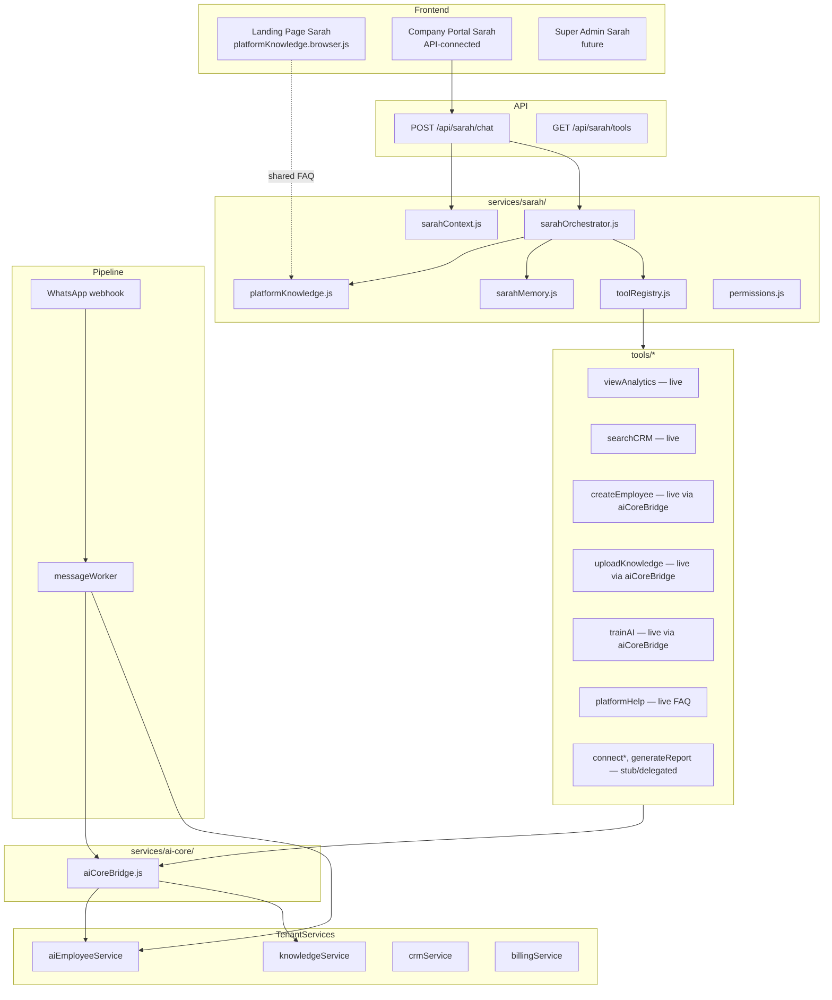

# Sarah — AI Operating Assistant

Sarah is the central conversational interface for the ZiricAI platform. Users perform actions by chatting instead of clicking through menus. Sarah works in the Company Portal today, with scoped access in Super Admin, and shares platform FAQ knowledge with the landing page widget.

## Integrated AI Core

Sarah is one leg of the AI Core triangle (see [AI_CORE.md](./AI_CORE.md)):

- **Sarah** — operating assistant with tool-calling
- **AI Employees** — customer-facing agents with role prompts + linked KB
- **Knowledge Base** — tenant documents for RAG-lite replies



## Tool status matrix

| Tool | Status | Service |
|------|--------|---------|
| platformHelp | **Live** | `platformKnowledge.js` FAQ |
| createEmployee | **Live** | `aiCoreBridge.createEmployeeWithKnowledge` |
| uploadKnowledge | **Live** | `aiCoreBridge.uploadKnowledgeForEmployee` |
| trainAI | **Live** | `aiCoreBridge.uploadKnowledgeForEmployee` |
| searchCRM | **Live** | `tenants/crmService` |
| viewAnalytics | **Live** | `tenantAnalyticsService` + portal demo |
| viewConversations | **Live** | conversation service |
| viewBilling | **Live** | billing service |
| connectWhatsApp | **Delegated** | integration wizard hints |
| connectFacebook/Instagram | **Stub** | integration Agent |
| generateReport | **Stub** | reporting Agent (future) |
| generateQuote | **Partial** | quote helper |
| bookAppointment | **Partial** | appointment service |
| createAutomation | **Partial** | automation registry |
| inviteUser / manageTeam | **Partial** | user service |

## Platform FAQ coverage

Shared constants in `js/shared/platformKnowledge.js`:

| Topic | Example questions |
|-------|-------------------|
| overview | How does ZiricAI work? |
| aiEmployee | What is an AI employee? |
| pricing | Plans from `billingPlans.js` (Starter R999.99 / Professional R2,999 / Business R4,999 / Enterprise Custom), trial |
| setup | Onboarding steps, 10 minutes |
| whatsapp | Meta API, QR connect |
| marketplace | Industry packs |
| integrations | Channels + connectors |
| crm | Leads, timeline, search |
| automation | Workflows, triggers |
| knowledge | Upload, PDF, FAQ |
| sarah | Operating assistant role |
| security | POPIA, encryption |

Demo mode (no OpenAI key) uses the same FAQ via keyword matching before invoking action tools.

## Session memory

| Field | Purpose |
|-------|---------|
| `lastAgentId` | Last discussed AI employee |
| `lastAgentName` | Name for follow-up ("train that agent") |
| `lastKnowledgeBaseId` | Active KB scope |
| `lastKbTopic` | Last uploaded document title |

Stored in-memory (4h TTL). Firestore strategy documented in `sarahMemory.js`.

## API

### POST `/api/sarah/chat`

```json
{ "message": "How does ZiricAI work?", "sessionId": "optional", "companyId": "demo-central-motors" }
```

Response:

```json
{
  "reply": "...",
  "sessionId": "sarah-...",
  "actions": [],
  "uiHints": [],
  "mode": "openai" | "demo"
}
```

### GET `/api/sarah/tools?companyId=...`

Lists tools available for the authenticated user's role.

## Surfaces

| Surface | Implementation |
|---------|----------------|
| Landing | `ziricai.html` + `platformKnowledge.browser.js` + `ziricai-landing.js` |
| Company Portal | `js/portal/sarah/*` → `/api/sarah/chat` |
| Super Admin | Same API, superadmin role → all tools (future UI) |
