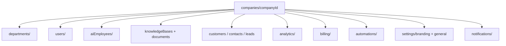

# Company Workspace Architecture

Every ZiricAI tenant is an isolated **company workspace**. All tenant data lives under `companies/{companyId}/`.

## Hierarchy



## Company root document

Path: `companies/{companyId}`

| Field | Type | Description |
|-------|------|-------------|
| `name` | string | Display name |
| `industry` | string | Industry label |
| `plan` | string | Billing plan id (`trial`, `starter`, `business`, …) |
| `status` | string | `active`, `trial`, `suspended`, `archived` |
| `ownerId` | string | Firebase UID of workspace owner |
| `branding` | map | Primary color, logo, favicon (also mirrored in settings) |
| `settings` | map | General workspace settings |
| `createdAt` | timestamp | Creation time |
| `provisionedAt` | timestamp | First full provision |

## Subcollections

| Subcollection | Purpose |
|---------------|---------|
| `departments/{deptId}` | Sales, Support, Operations (seeded on provision) |
| `users/{uid}` | Team membership: role, departmentId, status |
| `aiEmployees/{agentId}` | AI employee configs |
| `knowledgeBases/{kbId}` | Knowledge base roots |
| `customers/` | CRM records (adapter-backed in Phase 1) |
| `automations/{workflowId}` | Built-in + custom workflows |
| `analytics/` | Tenant metrics rollups |
| `billing/{companyId}` | Plan subscription record |
| `settings/branding` | White-label portal branding |
| `settings/general` | Timezone, locale, notifications prefs |
| `settings/provisioning` | Workspace links + provision checklist |

## Provisioning checklist

When `provisionCompany(companyId)` runs (onboarding, `POST /api/companies`, or `POST /api/platform/provision/company`):

1. **Company root** — name, plan, status, owner fields
2. **Departments** — Sales, Support, Operations
3. **Owner user** — `companies/{id}/users/{ownerUid}` with role `owner`
4. **Knowledge base** — `kb-{companyId}` + starter FAQ docs
5. **Default AI employee** — customer support agent linked to KB
6. **CRM workspace** — auto-create customers, scoring enabled
7. **Analytics seed** — zeroed metrics scope
8. **Billing record** — plan from company (`trial` on onboarding)
9. **Automation templates** — 5 built-in workflows via `workflowRegistry`
10. **Visual workflow** — inbound WhatsApp starter (workflowService)
11. **Activity + notification** — "Workspace ready"
12. **Event** — `CompanyProvisioned` on event bus

Returns `workspaceLinks` with portal hash routes to each area.

## API routes

| Method | Path | Scope |
|--------|------|-------|
| GET | `/api/companies/:companyId` | Tenant |
| PATCH | `/api/companies/:companyId` | Tenant + staff |
| POST | `/api/companies` | Platform (create + provision) |
| POST | `/api/companies/:companyId/suspend` | Tenant + staff |
| POST | `/api/companies/:companyId/archive` | Tenant + staff |
| GET/POST/PATCH/DELETE | `/api/companies/:companyId/departments` | Tenant |
| GET | `/api/companies/:companyId/team` | Tenant |
| POST | `/api/companies/:companyId/team/invite` | Tenant + staff |
| PATCH | `/api/companies/:companyId/team/:uid` | Tenant + staff |
| GET | `/api/portal/workspace/:companyId` | Tenant snapshot |
| GET | `/api/portal/hub/:companyId` | Hub + workspace metadata |

## Portal bootstrap

On login (`auth-guard.js`):

1. Resolve `profile.companyId` from Firestore (demo fallback only in lax mode)
2. Fetch company, team, notifications, usage
3. Load `/api/portal/workspace/:companyId` snapshot
4. Prefetch `/api/portal/hub/:companyId` (60s TTL)

Settings module shows **Workspace** tab with resource counts and nav links.

## Onboarding

`startOnboarding` → `provisionCompany` with trial plan and owner UID.

`completeOnboardingStep('complete')` saves branding/settings to tenant docs and links owner membership.

Industry step installs marketplace pack when `packId` is set.

## Verification (local)

```bash
node server.js
curl -X POST http://localhost:3000/api/companies \
  -H "Content-Type: application/json" \
  -d '{"companyId":"test-ws-1","name":"Test Workspace","ownerUid":"owner-1","ownerEmail":"owner@test.com","owner":"Test Owner"}'
curl http://localhost:3000/api/portal/hub/test-ws-1
curl http://localhost:3000/api/portal/workspace/test-ws-1
```

With `STORAGE_BACKEND=memory`, subcollections are in-memory via `TenantRepository`.

## Related agents

- **01 Platform Architecture** — schema, TenantRepository
- **02 Authentication** — profile.companyId, membership
- **04 Sarah AI** — workspace context (do not modify orchestrator here)
- **18 Super Admin** — multi-company selector (separate scope)
