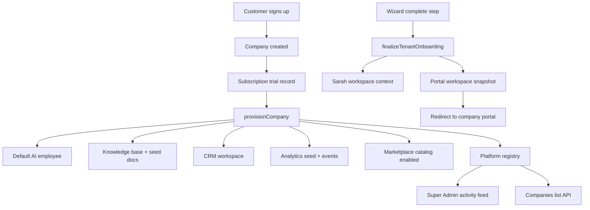

# Sprint 1 — Connect Everything

Production readiness pass: wire signup → live platform with zero manual steps.

## Automatic chain



## Entry points

| Endpoint | Purpose |
|----------|---------|
| `POST /api/onboarding/start` | Account step — provisions tenant immediately |
| `POST /api/onboarding/complete-step` | Wizard steps (industry, WhatsApp, KB, …) |
| `POST /api/onboarding/complete` | **One-shot** full chain for automation/tests |
| `GET /api/platform/companies` | Super Admin server-side tenant list |
| `GET /api/operations/activity` | Platform ops feed (includes new companies) |

## Events emitted

| Event | When |
|-------|------|
| `CompanyCreated` | After tenant root document is created |
| `SubscriptionStarted` | After trial billing record is saved |
| `CompanyProvisioned` | After full workspace provisioning |
| `KnowledgeUploaded` | Starter KB docs seeded |
| `LeadCaptured` | Optional demo lead on onboarding complete |

Analytics handler subscribes to `*` and ingests via `analyticsEngine`.

## Key modules

- `services/platform/onboardingOrchestrator.js` — `completeOnboarding()`
- `services/platform/tenantBootstrap.js` — platform ops, WhatsApp integration status, finalize
- `services/platform/platformRegistry.js` — super-admin memory registry (demo)
- `services/platform/provisioningService.js` — `provisionCompany()` workspace wiring
- `services/sarah/sarahContext.js` — agents, KB summary, workspace snapshot

## Verification

```bash
# Memory backend (no Firestore required)
STORAGE_BACKEND=memory node scripts/verify-sprint1-flow.js
```

### Manual checklist

- [ ] Run `npm run dev` — server starts without errors
- [ ] Open `http://localhost:3000/ziricai.html` — complete wizard with test account
- [ ] Portal redirect loads overview with empty/seeded states
- [ ] Sarah bubble responds with tenant context (agent names, KB count)
- [ ] Super Admin → Companies shows new tenant (not only localStorage demo)
- [ ] Super Admin → Command Center / Operations activity shows onboard event
- [ ] `GET /api/platform/companies` returns the new company

## Remaining manual / simulated steps

| Step | Status |
|------|--------|
| Firebase Auth signup | Real — client `registerUser()` |
| WhatsApp Meta connect | Simulated when env vars missing; integration record written |
| Train / Test wizard steps | UI animation; backend marks step complete |
| Document file upload in wizard | Files uploaded via API when selected; drag-drop without files uses starter KB only |
| Firestore persistence | Use `STORAGE_BACKEND=firestore` for production persistence |
| Super Admin registry | In-memory until Firestore platform collection is added |

## Environment

```bash
STORAGE_BACKEND=memory   # local dev / verification
PORT=3000
```

Optional for live WhatsApp: `PHONE_NUMBER_ID`, `WHATSAPP_TOKEN`, `VERIFY_TOKEN`
